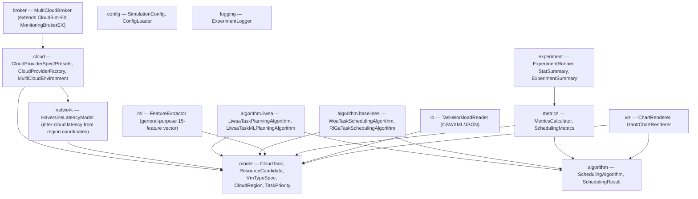
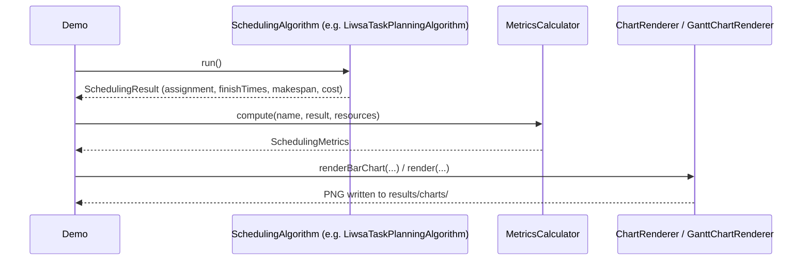
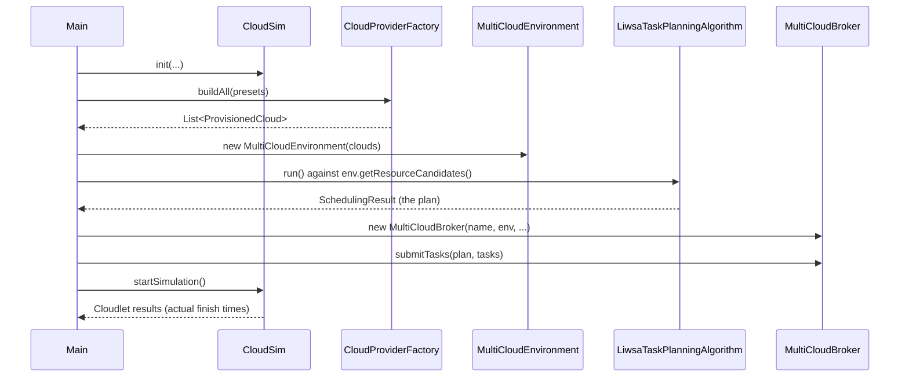
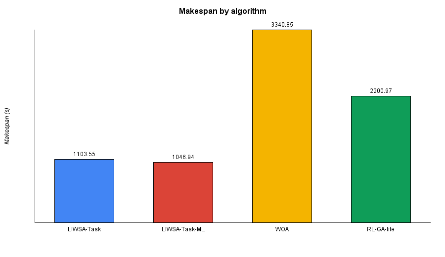
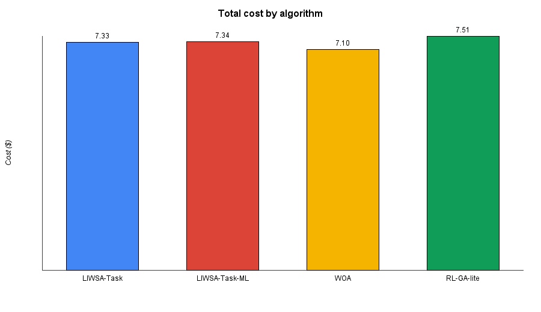
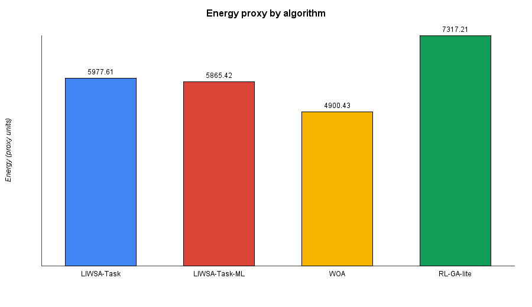
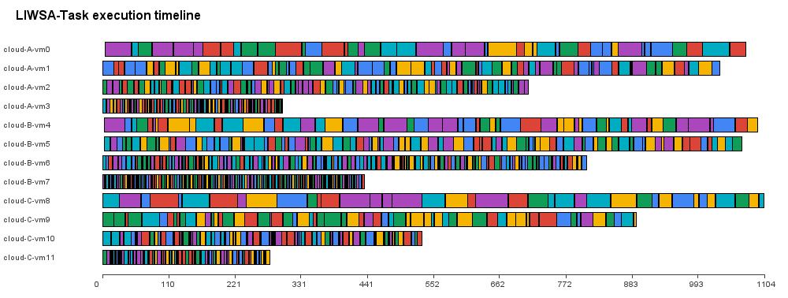

<div align="center">

# ☁️ LIWSA Multi-Cloud Task Scheduling Framework

**A density-adaptive, Pareto multi-objective, locust-swarm-inspired scheduler for independent task placement across multiple cloud providers.**


</div>

---

## 📋 Table of Contents

- [Overview](#-overview)
- [Key Features](#-key-features)
- [The Algorithms](#-the-algorithms)
- [Architecture](#️-architecture)
- [Execution Flow](#-execution-flow)
- [Sample Results](#-sample-results)
- [Project Structure](#-project-structure)
- [Getting Started](#-getting-started)
  - [Prerequisites](#prerequisites)
  - [Quick Start (Command Line / Maven)](#quick-start-command-line--maven)
  - [Eclipse IDE Setup (Step-by-Step)](#-eclipse-ide-setup-step-by-step)
- [Configuration](#️-configuration)
- [Running the Demos](#️-running-the-demos)
- [Design Notes & Known Limitations](#-design-notes--known-limitations)
- [Cloud Pricing Provenance](#-cloud-pricing-provenance)
- [License](#-license)

---

## 🎯 Overview

**LIWSA-Task** schedules independent ("bag-of-tasks") workloads across **multiple cloud providers simultaneously**, jointly choosing the task, the virtual machine, *and* the cloud for every item in the workload in a single search.

LIWSA-Task descends from an earlier version of LIWSA built for scheduling DAG-based workflows on a single cloud. This framework keeps the algorithm's core behavioural logic numerically unchanged, Pareto dominance ranking, self-calibrated crowding density, density-driven solitary/gregarious phase switching, and the signed-voting and roulette-copy movement operators, while retargeting the *decoder*: the genotype's alphabet is now a flat list of VMs spanning **every** cloud, so one search performs task, VM, and cloud-provider selection at once. A task's ready time simplifies to its arrival time (no dependencies, no data-transfer-cost term) since this is an independent-task workload rather than a workflow.

The framework is built on **CloudSim 7.0.1 ("CloudSim 7G")** and ships with a light-ML variant of LIWSA-Task plus two literature-grounded baseline algorithms for fair comparison.

## ✨ Key Features

- 🐝 **LIWSA-Task** — the core Pareto multi-objective, locust-swarm-inspired scheduler
- 🧠 **LIWSA-Task-ML** — a light in-house OLS warm-start variant
- ⚖️ **Two baselines** — WOA and RL-GA-lite, grounded in published literature
- ☁️ **True multi-cloud modelling** — per-provider host/VM catalogs, pricing, and inter-cloud latency
- 🌍 **Haversine latency model** — inter-cloud network delay estimated from region coordinates
- 📊 **Built-in analytics** — cost, energy, utilization, and Gantt/timeline charts, no charting library required
- 🧪 **Statistical experiment runner** — mean / min / max / stddev / 95% CI over N independent runs
- 📈 **Low-to-high load sweep** — one combined CSV *and* four scaling charts across task-count tiers (100 to 100,000+) in a single run, via `ScalabilityDemo`
- ⚙️ **Fully configurable** — every knob exposed via a single `config.properties`
- 🔌 **CloudSim-integrated** — can run purely analytically, or drive a real CloudSim simulation end-to-end

## 🧬 The Algorithms

| Algorithm | Package | ML? | Grounding |
|---|---|---|---|
| **LIWSA-Task** | `algorithm.liwsa` | No | Original LIWSA behavioural analogy, re-targeted to independent multi-cloud task scheduling |
| **LIWSA-Task-ML** | `algorithm.liwsa` | Light (in-house OLS) | Warm-start variant of LIWSA-Task |
| **WOA** | `algorithm.baselines` | No | Mirjalili & Lewis, *Adv. Eng. Softw.* 95:51-67 (2016); adapted to bag-of-tasks scheduling in the spirit of Chhabra et al., *Energies* 15(13):4571 (2022) |
| **RL-GA-lite** | `algorithm.baselines` | Light (tabular Q-learning + GA) | Operationalizes the RL-GA-LSTM-AE concept of Narsimhulu & Kumar, *Sci. Rep.* 16:14961 (2026); the LSTM-Autoencoder is replaced with a classical EWMA/z-score load forecaster, documented as a transparent lightweight substitute in that class's Javadoc |

All four implement `algorithm.SchedulingAlgorithm` (`run()` → `SchedulingResult`, `getName()`), so they are interchangeable throughout the framework.

> [!TIP]
> `MultiCloudBroker` exposes `discoverClouds()`, `selectCloud()` / `selectVM()`, `submitTasks()`, `migrateTask()`, `getQueueLength(vmId)`, and `collectMetrics()`. `ResourceCandidate` carries the full VM capacity picture (MIPS, PEs, RAM, bandwidth, storage, cost-per-second), not just the subset the algorithms strictly need to decode a schedule.

## 🏗️ Architecture



## 🔄 Execution Flow

**Analytic mode** (no CloudSim simulation, fastest path):



**Full CloudSim simulation mode** (real discrete-event simulation):



## 📊 Sample Results

Output produced by `FullDemo` on the default synthetic 1000-task workload, comparing all four algorithms:

<div align="center">









</div>

## 📁 Project Structure

```
MultiCloud_LIWSA/
├── pom.xml                              # liwsa-multicloud module descriptor
├── modules/
│   ├── cloudsim/                        # CloudSim 7.0.1 simulation core
│   ├── cloudsim-examples/               # CloudSim's own bundled examples
│   └── liwsa-multicloud/                # ⭐ the algorithm — your code lives here
│       └── src/main/
│           ├── java/
│           │   └── org/liwsa/multicloud/
│           │       ├── algorithm/           # SchedulingAlgorithm contract + results
│           │       │   ├── liwsa/           # LIWSA-Task, LIWSA-Task-ML
│           │       │   └── baselines/       # WOA, RL-GA-lite
│           │       ├── broker/              # MultiCloudBroker
│           │       ├── cloud/               # Provider specs, presets, factory, environment
│           │       ├── config/              # SimulationConfig, ConfigLoader
│           │       ├── experiment/          # ExperimentRunner, statistics
│           │       ├── io/                  # Task workload readers (CSV/XML/JSON)
│           │       ├── logging/             # ExperimentLogger
│           │       ├── metrics/             # MetricsCalculator, SchedulingMetrics
│           │       ├── ml/                  # FeatureExtractor
│           │       ├── model/               # CloudTask, ResourceCandidate, VmTypeSpec, ...
│           │       ├── network/             # HaversineLatencyModel
│           │       ├── viz/                 # ChartRenderer, GanttChartRenderer
│           │       ├── Demo.java            # entry point 1
│           │       ├── ExperimentDemo.java  # entry point 2
│           │       ├── FullDemo.java        # entry point 3 (recommended first run)
│           │       ├── CloudSimDemo.java    # entry point 4
│           │       └── ScalabilityDemo.java # entry point 5 (low-to-high task-count sweep)
│           └── resources/
│               └── config.properties        # see the Configuration section below
├── RequiredJars/                        # bundled copies of every jar in the table below
└── results/                             # CSVs and charts land here
```

## 🚀 Getting Started

### Prerequisites

| Requirement | Version |
|---|---|
| JDK | 21 |
| Maven | 3.8+ (optional, only for the command-line path) |
| Eclipse IDE for Java Developers | 2023-12+ recommended |

### Quick Start (Command Line / Maven)

This module is designed to sit as a sibling of `cloudsim` and `cloudsim-examples` inside a full CloudSim 7.0.1 checkout:

```
cloudsim-7.0.1/
  pom.xml                       <- add <module>modules/liwsa-multicloud</module>
  modules/
    cloudsim/
    cloudsim-examples/
    liwsa-multicloud/           <- this module
```

Then, from the `cloudsim-7.0.1` root:

```bash
mvn -q -pl modules/cloudsim,modules/liwsa-multicloud -am install
mvn -q -pl modules/liwsa-multicloud exec:java -Dexec.mainClass=org.liwsa.multicloud.FullDemo
```

> [!NOTE]
> Prefer to keep it fully standalone instead of wiring it into a parent reactor? Build and `mvn clean install` the official CloudSim 7.0.1 project once (this populates your local `~/.m2` repository), and this module's own `pom.xml` will resolve `org.cloudbus.cloudsim:cloudsim:7.0.1` from there.

### 🖥️ Eclipse IDE Setup (Step-by-Step)

This project already ships with an Eclipse `.project` / `.classpath` pair (as a plain Java project, not an m2e-managed one), so the fastest path is to import it directly and then repoint the library entries at jars on **your** machine.

**1. Import the project**
1. Extract the project archive somewhere on disk.
2. In Eclipse: **File → Import… → General → Existing Projects into Workspace → Next**.
3. Set *Root Directory* to the extracted folder (the one containing `pom.xml`, `README.md`, `modules/`).
4. Eclipse detects a project called **`CloudSim7_MultiCloud`**. Tick it → **Finish**.

You'll see red error markers everywhere right after import, that's expected. The bundled `.classpath` points at jar locations on the original machine, which the next steps fix.

**2. Set the JRE to Java 21**
- Right-click the project → **Build Path → Configure Build Path… → Libraries** tab.
- Select the *JRE System Library* entry → **Edit…** → choose or add a **JavaSE-21** execution environment.

**3. Download the required libraries**

> [!TIP]
> All of these are already bundled as actual jar files in **[`RequiredJars/`](RequiredJars/)** at the repo root, so in practice you can skip the downloads below and point **Add External JARs…** (step 4) at that folder directly. The table is still here for provenance/versioning, and in case you'd rather fetch a specific one fresh.
>
> ⚠️ **Known mismatch:** `RequiredJars/opencsv-5.0.jar` is the wrong version — this project (see `modules/cloudsim/pom.xml` and the `.classpath` entry) is built against **OpenCSV 5.9**. Swap in `opencsv-5.9.jar` (link in the table below) if you use the bundled folder as-is.

Download each jar below into a folder of your choice (e.g. a `lib/` folder next to the project), or use the bundled copies described above:

| Library | Version | Direct download |
|---|---|---|
| Guava | 33.0.0-jre | https://repo1.maven.org/maven2/com/google/guava/guava/33.0.0-jre/guava-33.0.0-jre.jar |
| Apache Commons Lang3 | 3.14.0 | https://repo1.maven.org/maven2/org/apache/commons/commons-lang3/3.14.0/commons-lang3-3.14.0.jar |
| Apache Commons Math3 | 3.6.1 | https://repo1.maven.org/maven2/org/apache/commons/commons-math3/3.6.1/commons-math3-3.6.1.jar |
| Apache Commons Net | 3.11.1 | https://repo1.maven.org/maven2/commons-net/commons-net/3.11.1/commons-net-3.11.1.jar |
| Apache Commons IO | 2.14.0 | https://repo1.maven.org/maven2/commons-io/commons-io/2.14.0/commons-io-2.14.0.jar |
| Uncommons Maths | 1.2.3 | https://repo1.maven.org/maven2/io/gatling/uncommons/maths/uncommons-maths/1.2.3/uncommons-maths-1.2.3.jar |
| OpenCSV | **5.9** *(RequiredJars/ currently ships 5.0 — see warning above)* | https://repo1.maven.org/maven2/com/opencsv/opencsv/5.9/opencsv-5.9.jar |
| MaxMind GeoIP2 | 4.2.1 | https://repo1.maven.org/maven2/com/maxmind/geoip2/geoip2/4.2.1/geoip2-4.2.1.jar |
| Jackson Databind | 2.17.1 | https://repo1.maven.org/maven2/com/fasterxml/jackson/core/jackson-databind/2.17.1/jackson-databind-2.17.1.jar |
| Jackson Core | 2.17.1 | https://repo1.maven.org/maven2/com/fasterxml/jackson/core/jackson-core/2.17.1/jackson-core-2.17.1.jar |
| Jackson Annotations | 2.17.1 | https://repo1.maven.org/maven2/com/fasterxml/jackson/core/jackson-annotations/2.17.1/jackson-annotations-2.17.1.jar |
| EasyMock *(test-only)* | 5.5.0 | https://repo1.maven.org/maven2/org/easymock/easymock/5.5.0/easymock-5.5.0.jar |
| JUnit Jupiter API *(test-only, also in `RequiredJars/`)* | 5.10.2 | https://repo1.maven.org/maven2/org/junit/jupiter/junit-jupiter-api/5.10.2/junit-jupiter-api-5.10.2.jar |

**4. Fix the build path**
- Right-click project → **Build Path → Configure Build Path… → Libraries** tab.
- Remove every entry showing a red error icon.
- Click **Add External JARs…** and select all the jars you just downloaded.
- *(Optional — only needed if you also want to compile/run CloudSim's own test suite)* Add **Library → JUnit → JUnit 5**, and keep the EasyMock jar.

**5. Confirm the source folders**

Still in *Configure Build Path…*, on the **Source** tab you should see:

- `modules/cloudsim/src/main/java` — **required**
- `modules/liwsa-multicloud/src/main/java` — **required** (this is the LIWSA algorithm)
- `modules/liwsa-multicloud/src/main/resources` — **required** (this is `config.properties`; see [Configuration](#️-configuration))
- `modules/cloudsim/src/test/java`, `modules/cloudsim-examples/...` — **optional**, only needed if you also want CloudSim's own bundled tests/examples

If you only care about the scheduling algorithm, feel free to remove the two optional source folders (and the EasyMock/JUnit libraries with them) to keep the project lighter.

**6. Run it**
1. In the *Package Explorer*, expand `modules/liwsa-multicloud/src/main/java` → `org.liwsa.multicloud`.
2. Right-click **`FullDemo.java`** → **Run As → Java Application**.
3. Console output appears immediately; CSVs land in `results/`, charts in `results/charts/`.

> [!NOTE]
> `config.properties` lives in `src/main/resources`, which is on the classpath by default for both Eclipse (already reflected in the bundled `.classpath`, per step 5 above) and a plain `mvn` command-line build — no extra setup needed either way. See [Configuration](#️-configuration) below for the full key reference.

## ⚙️ Configuration

All simulation and algorithm parameters are controlled from a single `config.properties`, loaded via `ConfigLoader.loadDefault()`. Every key is optional; anything omitted falls back to `SimulationConfig`'s built-in default.

| Key | Default | Meaning |
|---|---|---|
| `simulation.randomSeed` | 42 | Seed for synthetic workload generation and the algorithms |
| `simulation.numTasks` | 1000 | Size of the synthetic workload, if no workload file is given |
| `simulation.taskWorkloadPath` | *(blank)* | Path to a CSV/XML/JSON workload file; blank = generate synthetic |
| `simulation.taskWorkloadFormat` | csv | `csv` \| `xml` \| `json`, see `io.TaskWorkloadReader`'s Javadoc for the schema |
| `simulation.resultsOutputDir` | results | Where logs/CSVs/charts are written |
| `simulation.taskCountSweep` | 100,1000,10000,100000 | Comma-separated task counts for `ScalabilityDemo`'s low-to-high load sweep |
| `algorithm.populationSize` | 30 | Shared by LIWSA-Task, LIWSA-Task-ML, WOA, RL-GA-lite |
| `algorithm.generationCount` | 100 | Generations/iterations per run |
| `algorithm.numExperimentRuns` | 30 | Independent runs in `ExperimentRunner` |
| `cloud.instancesPerVmType` | 4 | VMs provisioned per catalog type per cloud |
| `broker.monitoringPeriod` | -1 | Seconds between `MultiCloudBroker` utilisation samples; -1 disables |

Per-cloud hardware (host counts/PEs/RAM, VM catalogs, pricing) currently lives in `cloud.CloudProviderPresets` as code rather than as properties, documented on that class as a deliberate scope boundary.

> [!NOTE]
> `ConfigLoader.loadDefault()` looks for `config.properties` on the **classpath root** via `getResourceAsStream`. It lives at `src/main/resources/config.properties`, which both Maven (by default convention) and Eclipse (via the bundled `.classpath`, see [Eclipse setup](#-eclipse-ide-setup-step-by-step) step 5) already put on the classpath, so no manual fix is needed.

## ▶️ Running the Demos

Five entry points, in increasing order of what they exercise:

- **`Demo`** — the four algorithms against a synthetic in-memory workload, no CloudSim, no config/logging/viz. Fastest smoke test that the algorithm layer works.
- **`ExperimentDemo`** — the full 30-run × 4-algorithm statistical comparison (mean/min/max/stddev/95% CI), writes raw per-run CSVs to `results/`.
- **`FullDemo`** — the recommended first run: reads `config.properties`, one run of each algorithm, structured logging, metrics, and chart generation.
- **`CloudSimDemo`** — the only one that actually drives a CloudSim simulation (`CloudSim.init` → provisioned clouds → `MultiCloudBroker` → `startSimulation`), cross-checking the planner's predicted makespan against what CloudSim actually simulated.
- **`ScalabilityDemo`** — a low-to-high **load sweep**: runs all four algorithms once each at every task count in `simulation.taskCountSweep` (100 / 1,000 / 10,000 / 100,000 by default), appends every result to one combined `results/scalability-sweep.csv`, and renders four "metric vs. task count" line charts (makespan, cost, energy proxy, algorithm runtime) to `results/charts/`, one line per algorithm each. See the Javadoc on the class itself for the two algorithm-level performance fixes this relies on to keep the 10,000/100,000 tiers practical.

From Eclipse: right-click the relevant class → **Run As → Java Application**. From the command line: `mvn -pl modules/liwsa-multicloud exec:java -Dexec.mainClass=org.liwsa.multicloud.<ClassName>`.

## 🔬 Design Notes & Known Limitations

A few things were scoped down deliberately rather than left half-done:

- **Energy and carbon are illustrative proxies** (a linear idle+dynamic power model, a single global grid-carbon-intensity constant), not physical measurements. Swapping in CloudSim's real `power` package (`PowerHost`/`PowerModelSpecPower`, real SPECpower curves) is a natural next step for higher fidelity.
- **Inter-cloud latency** is a Haversine great-circle-distance estimate (`network.HaversineLatencyModel`, queryable via `MultiCloudEnvironment.getLatencyMs`), not a measured or CloudSim-simulated network delay, chosen deliberately over CloudSim 7G's IP/MaxMind-GeoIP2-driven `geolocation` package since that requires a licensed database file this framework doesn't ship.
- **`MultiCloudBroker.migrateTask()`** only rebinds a task that hasn't been dispatched yet; CloudSim's Cloudlet model has no notion of relocating an already-running task. Real live migration belongs at the VM/host level via CloudSim's `VmAllocationPolicyMigration*` family, not yet wired in.
- **Host-level idle time and migration counts** aren't in `MetricsCalculator` because they need an actual running simulation's events rather than this static-plan calculator; VM-level idle time is included since it's derivable from the plan alone.
- **`ml.FeatureExtractor`**'s `cloudReliability` and `slaViolationRate` inputs default to "perfectly reliable, no violations" unless the caller supplies real tracked values, since this framework doesn't yet accumulate that history itself across runs.
- **Visualization** covers "category → number" charts (cost, energy, utilization, task distribution) with one generic bar-chart renderer, plus a dedicated Gantt/execution-timeline renderer, both pure `java.awt`/`javax.imageio`, no charting library dependency required.

## 💰 Cloud Pricing Provenance

AWS/Azure/GCP figures in `CloudProviderPresets` are grounded in confirmed on-demand pricing at the time of writing (AWS `m6i.large` and Azure `D2s_v5` both at $0.096/hr), with other tiers extrapolated using each provider's public pricing structure. Re-check current pricing pages before citing these numbers in a publication.

## 📄 License

The bundled CloudSim 7.0.1 core (`modules/cloudsim`, `modules/cloudsim-examples`) is distributed under the **Apache License 2.0**. This repository does not yet declare a license for the new `liwsa-multicloud` module itself, add one (e.g. MIT or Apache-2.0) before publishing or sharing this code publicly.
