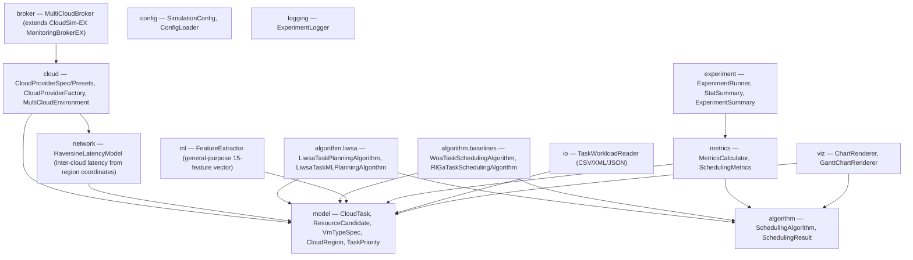
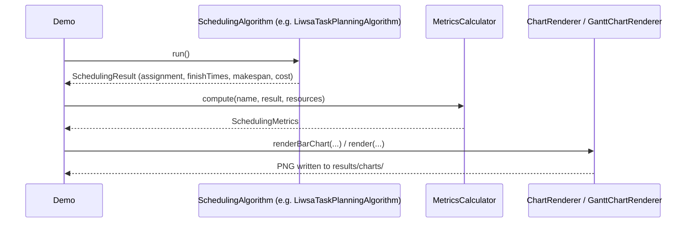
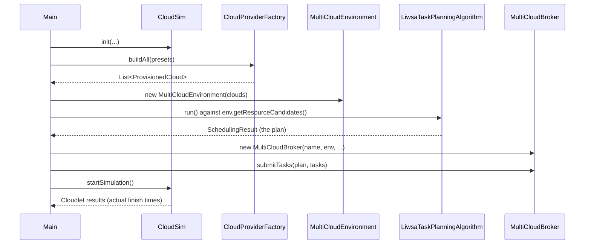

# LIWSA Multi-Cloud Task Scheduling Framework

A multi-cloud task scheduling research framework built on **CloudSim 7.0.1 ("CloudSim 7G")**,
centred on **LIWSA-Task** — a density-adaptive, Pareto multi-objective, locust-swarm-inspired
scheduler retargeted from the original workflow-scheduling LIWSA algorithm to independent
task scheduling across multiple cloud providers — plus a light-ML variant and two
literature-grounded baselines.

## Why this exists

The original LIWSA algorithm scheduled DAG workflows on a single cloud (WorkflowSim 1.1.0 /
CloudSim 3.0.3). This framework keeps LIWSA's core behavioural analogy (Pareto dominance,
self-calibrated crowding density, density-driven solitary/gregarious phase switching, the
signed-voting and roulette-copy movement operators) numerically identical, and re-targets the
*decoder* at independent, multi-cloud tasks: the genotype's alphabet is a flat list of VMs
spanning every cloud, so one search simultaneously performs task, VM, *and* cloud-provider
selection.

## Package architecture



## Typical run sequence (analytic, no CloudSim simulation)



## Typical run sequence (real CloudSim simulation)



## The four algorithms

| Algorithm | Package | ML? | Grounding |
|---|---|---|---|
| **LIWSA-Task** | `algorithm.liwsa` | No | Your original LIWSA, re-targeted (see above) |
| **LIWSA-Task-ML** | `algorithm.liwsa` | Light (in-house OLS) | Ported from your LIWSA-ML warm-start |
| **WOA** | `algorithm.baselines` | No | Mirjalili & Lewis 2016 (*Adv. Eng. Softw.* 95:51-67); adapted to bag-of-tasks scheduling in the spirit of Chhabra et al. 2022 (*Energies* 15(13):4571) |
| **RL-GA-lite** | `algorithm.baselines` | Light (tabular Q-learning + GA) | Operationalizes Narsimhulu & Kumar 2026 (*Sci. Rep.* 16:14961)'s RL-GA-LSTM-AE concept; the LSTM-Autoencoder is replaced with a classical EWMA/z-score load forecaster — documented in that class's Javadoc as a transparent lightweight substitute, not a verbatim reproduction |

All four implement `algorithm.SchedulingAlgorithm` (`run()` → `SchedulingResult`, `getName()`).

`MultiCloudBroker` exposes `discoverClouds()`, `selectCloud()`/`selectVM()`, `submitTasks()`,
`migrateTask()`, `getQueueLength(vmId)`, and `collectMetrics()`. `ResourceCandidate` carries
mips/pes/ram/bandwidth/storage/cost-per-second — the full VM capacity picture, not just the
subset the algorithms strictly need to decode a schedule.

## How to build and run

This module is meant to sit as a sibling of `cloudsim` and `cloudsim-examples` inside a
CloudSim 7.0.1 checkout:

```
cloudsim-7.0.1/
  pom.xml                       <- add <module>modules/liwsa-multicloud</module>
  modules/
    cloudsim/
    cloudsim-examples/
    liwsa-multicloud/           <- this module
```

Then, from the `cloudsim-7.0.1` root:

```
mvn -q -pl modules/cloudsim,modules/liwsa-multicloud -am install
mvn -q -pl modules/liwsa-multicloud exec:java -Dexec.mainClass=org.liwsa.multicloud.FullDemo
```

Four entry points, in increasing order of what they exercise:

- **`Demo`** — the four algorithms against a synthetic in-memory workload, no CloudSim, no
  config/logging/viz. Fastest smoke test that the algorithm layer itself works.
- **`ExperimentDemo`** — the full 30-run × 4-algorithm statistical comparison
  (mean/min/max/stddev/95% CI), writes raw per-run CSVs to `results/`.
- **`FullDemo`** — the "how do I run this project" entry point: reads `config.properties`,
  one run of each algorithm, structured logging, metrics, and chart generation.
- **`CloudSimDemo`** — the only one that actually drives a CloudSim simulation
  (`CloudSim.init` → provisioned clouds → `MultiCloudBroker` → `startSimulation`), and
  cross-checks the planner's predicted makespan against what CloudSim actually simulated.

## `config.properties` reference

See `src/main/resources/config.properties` for the fully-commented copy. Recognised keys:

| Key | Default | Meaning |
|---|---|---|
| `simulation.randomSeed` | 42 | Seed for synthetic workload generation and (via `FullDemo`) the algorithms |
| `simulation.numTasks` | 60 | Size of the synthetic workload, if no workload file is given |
| `simulation.taskWorkloadPath` | *(blank)* | Path to a CSV/XML/JSON workload file; blank = generate synthetic |
| `simulation.taskWorkloadFormat` | csv | `csv` \| `xml` \| `json` — see `io.TaskWorkloadReader`'s Javadoc for the schema |
| `simulation.resultsOutputDir` | results | Where logs/CSVs/charts are written |
| `algorithm.populationSize` | 30 | Shared by LIWSA-Task, LIWSA-Task-ML, WOA, RL-GA-lite |
| `algorithm.generationCount` | 100 | Generations/iterations per run |
| `algorithm.numExperimentRuns` | 30 | Independent runs in `ExperimentRunner` |
| `cloud.instancesPerVmType` | 4 | VMs provisioned per catalog type per cloud |
| `broker.monitoringPeriod` | -1 | Seconds between `MultiCloudBroker` utilisation samples; -1 disables |

Per-cloud hardware (host counts/PEs/RAM, VM catalogs, pricing) currently lives in
`cloud.CloudProviderPresets` as code rather than as properties — documented on that class as a
deliberate scope boundary, not an oversight.

## Honest scope notes

This was built and reviewed carefully against the actual CloudSim 7.0.1 source, but **this
sandbox has no `javac`/Maven available**, so nothing here has been compiler-verified — only
hand-traced against real method signatures and structurally balance-checked. Expect to be the
first real build; report back anything that doesn't compile.

A few things were scoped down deliberately rather than left half-done:

- **Energy and carbon are illustrative proxies** (a linear idle+dynamic power model, a single
  global grid-carbon-intensity constant), not physical measurements. Swapping in CloudSim's
  real `power` package (`PowerHost`/`PowerModelSpecPower`, real SPECpower curves) is a natural
  next step if a reviewer wants that fidelity.
- **Inter-cloud latency** is a Haversine-great-circle-distance estimate
  (`network.HaversineLatencyModel`, queryable via `MultiCloudEnvironment.getLatencyMs`), not a
  measured or CloudSim-simulated network delay — deliberately simple and labelled as such,
  chosen over CloudSim 7G's IP/MaxMind-GeoIP2-driven `geolocation` package because that needs a
  licensed database file this framework doesn't ship.
- **`MultiCloudBroker.migrateTask()`** only rebinds a task that hasn't been dispatched yet;
  CloudSim's Cloudlet model has no notion of relocating an already-running task. Real live
  migration belongs at the VM/host level via CloudSim's `VmAllocationPolicyMigration*` family,
  which this framework doesn't yet wire in.
- **Host-level idle time and migration counts** aren't in `MetricsCalculator` because they need
  an actual running simulation's events, not this static-plan calculator; VM-level idle time
  is included since it's derivable from the plan alone.
- **`ml.FeatureExtractor`**'s `cloudReliability` and `slaViolationRate` inputs default to
  "perfectly reliable, no violations" unless the caller supplies real tracked values — this
  framework doesn't yet accumulate that history itself across runs.
- **Visualization** covers the "category → number" charts (cost, energy, utilization, task
  distribution) with one generic bar-chart renderer, plus a dedicated Gantt/execution-timeline
  renderer — both pure `java.awt`/`javax.imageio`, no charting library dependency to keep the
  build self-contained.

## Provenance of the pricing figures

AWS/Azure/GCP figures in `CloudProviderPresets` are grounded in confirmed on-demand pricing at
the time of writing (AWS `m6i.large` and Azure `D2s_v5` both at $0.096/hr), with the other
tiers extrapolated using each provider's public pricing structure. Re-check current pricing
pages before reporting these numbers in a publication.
